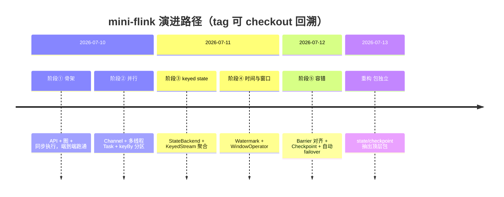

# mini-flink 项目演进路径

> 本文档是 mini-flink 的**演进脉络导航图**：一张时间线 + 每阶段一句话目标，让你快速读懂"项目如何一步步长出来"。
> 想深入**单个机制的静态设计** → `docs/architecture.md`；想看**某阶段的设计决策** → `docs/superpowers/specs/`；想看**实现步骤** → `docs/superpowers/plans/`；想**运行示例** → `docs/examples/`。

## 总览

mini-flink 是学习用简化版 Flink，2026-07-10 ~ 07-13 共 4 天、90 个提交，按 5 阶段 + 1 重构演进。每个阶段都先写 spec/plan，再 TDD 实现，最后补可运行示例。

---

## 阶段① 骨架（stage1-skeleton）

- **目标：** 搭起"算子链路 + 图调度 + 同步执行"的最小骨架，证明 DataStream API 能端到端跑通。
- **为何需要：** 从零开始，先要一个能 `map`/`filter`/`flatMap` + `collect` 跑通的最小闭环，把 API、逻辑图、执行图三层打通。
- **核心类：** `DataStream`、`StreamExecutionEnvironment`、`Transformation`、`StreamGraph`、`ExecutionGraph`、`MapOperator`/`FilterOperator`/`FlatMapOperator`、`Collector`、`CollectionSource`。
- **代表提交：** `bf908ae` ExecutionGraph + 同步 StreamExecutor，端到端跑通。
- **前后对比：** 无 → 单线程同步跑通 map/filter/collect 流作业。
- **回溯：** `git checkout stage1-skeleton`（锚点 `72425a0`）。

## 阶段② 并行（stage2-parallel）

- **目标：** 把单线程同步执行升级为多并行度，引入有界通道、算子链、Task 抽象与 hash 分区。
- **为何需要：** 阶段①是同步单线程，无法表达并行度与分区；真实流处理需要 fan-out、rebalance 与反压。
- **核心类：** `Channel`（BlockingQueue 反压）、`OperatorChain`/`ChainCollector`、`Task`/`SourceTask`/`OperatorTask`、`Partitioner`/`KeySelector`、`ExecutionVertex`/`ExecutionEdge`、`StreamExecutor`（多线程）、`Output`/`OutputCollector`。
- **代表提交：** `44b374a` Task/SourceTask/OperatorTask 多线程 + EOB 引用计数对齐；`d36cd2d` setParallelism + keyBy hash 分区。
- **前后对比：** 单线程同步 → 多并行度线程化 + keyBy 分区 + 反压通道。
- **回溯：** `git checkout stage2-parallel`（锚点 `59dc91a`）。

## 阶段③ keyed state（stage3-keyed-state）

- **目标：** 引入托管状态（ValueState/ListState/MapState）与 keyed 语义，支撑按 key 聚合。
- **为何需要：** 阶段②只有无状态算子，做不了 WordCount 这类按 key 累积；需要 state backend + currentKey 寻址。
- **核心类：** `StateBackend`、`ValueState`/`ListState`/`MapState` 及其 Impl（重构后位于 `org.miniflink.state`）、`RuntimeContext`/`RuntimeContextImpl`、`KeyedStream`、`ReduceFunction`/`ReduceOperator`。
- **代表提交：** `5847eb2` StateBackend + 三种 state；`cd5ec74` KeyedStream + reduce/sum。
- **前后对比：** 无状态 → 按 key 托管状态聚合。
- **回溯：** `git checkout stage3-keyed-state`（锚点 `819a839`）。

## 阶段④ 时间与窗口（stage4-window）

- **目标：** 引入事件时间、watermark、定时器与窗口，支撑按时间窗口聚合。
- **为何需要：** 阶段③只有即时按键聚合，无法表达"每 5 秒一个滚动窗"；需要 event time + watermark + trigger。
- **核心类：** `Record`（事件时间戳）、`Watermark`（StreamElement）、`WatermarkStrategy`/`TimestampsAndWatermarksOperator`、`TimerService`/`InternalTimerService`、`WindowAssigner`（Tumbling/Sliding）、`Trigger`/`EventTimeTrigger`、`WindowOperator`、`WindowedStream`。
- **代表提交：** `e0781ab` WindowOperator per-key per-window MapState + watermark 触发；`5251957` WindowedStream + 窗口 reduce。
- **前后对比：** 即时按键聚合 → 事件时间窗口聚合（迟到丢弃）。
- **回溯：** `git checkout stage4-window`（锚点 `5ce4358`）。

## 阶段⑤ 容错（stage5-fault-tolerance）

- **目标：** 实现 Chandy-Lamport barrier 对齐 + checkpoint 持久化 + 自动 failover，达到 exactly-once。
- **为何需要：** 阶段④状态只在内存，故障即丢；需要 barrier 广播对齐 + 快照 + 从 checkpoint 恢复。
- **核心类：** `Barrier`（StreamElement）、`InputChannel`/`InputGate`（对齐）、`StateSnapshot`/`SubtaskSnapshot`/`Checkpoint`（重构后位于 `org.miniflink.checkpoint`）、`CheckpointCoordinator`、source offset 断点重放、failover 循环。
- **代表提交：** `6fe1b7d` InputChannel + InputGate 封装 Chandy-Lamport 对齐；`88b4b78` CheckpointCoordinator 周期触发（exactly-once）；`f3cc25c` 自动 failover 循环。
- **前后对比：** 故障即丢状态 → exactly-once（barrier 对齐 + 快照 + 自动恢复）。
- **回溯：** `git checkout stage5-fault-tolerance`（锚点 `45261e8`）。

## 重构 包独立（refactor-packages）

- **目标：** 把 state、checkpoint 从 `runtime` 包抽出为顶层包，改善分层。
- **为何需要：** 阶段⑤后 `runtime` 包过载，state/checkpoint 是独立关注点，应自成顶层包。
- **核心类：** `org.miniflink.state`（10 类）、`org.miniflink.checkpoint`（3 类）。
- **代表提交：** `1394c25` state 顶层包；`f5895eb` checkpoint 顶层包。
- **前后对比：** state/checkpoint 散在 `runtime` → 独立顶层包。
- **回溯：** `git checkout refactor-packages`（锚点 `fd3b57e`）。

---

## 文档导航

| 想了解 | 去看 |
|---|---|
| 单个机制的静态分层设计 | `docs/architecture.md` |
| 某阶段的设计决策细节 | `docs/superpowers/specs/2026-07-1*-*.md` |
| 某阶段的实现步骤 | `docs/superpowers/plans/2026-07-1*-*.md` |
| 各阶段可运行示例 | `docs/examples/*.md` |
| 回溯某阶段代码 | `git checkout stageN-*`（见上文各节锚点）|
