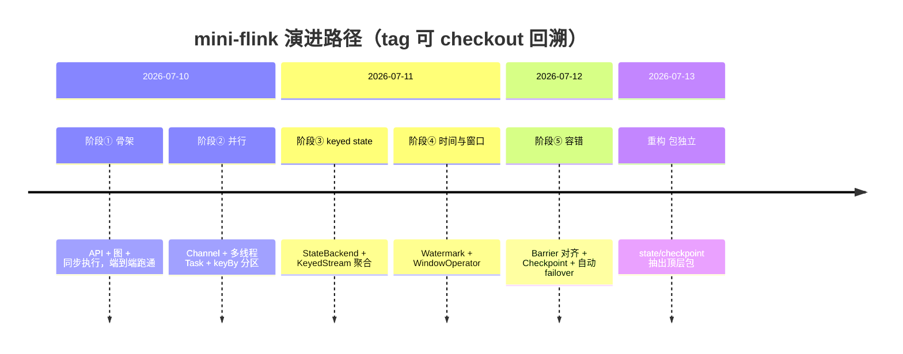

# 项目演进路径 Implementation Plan

> **For agentic workers:** REQUIRED SUB-SKILL: Use superpowers:subagent-driven-development (recommended) or superpowers:executing-plans to implement this plan task-by-task. Steps use checkbox (`- [ ]`) syntax for tracking.

**Goal:** 产出一份高层演进路线图文档 `docs/evolution.md` + 6 个 Git 阶段 tag，让人能一眼读懂 mini-flink 的 5 阶段 + 重构演进脉络，并能 `checkout` 回溯每个阶段代码形态。

**Architecture:** 纯文档 + git 元数据，零源码改动。文档与现有 `architecture.md`（静态架构）正交互补；tag 为轻量 tag，锚点全部位于 `main` 主线（已在 spec 核实）。

**Tech Stack:** Markdown + Mermaid（timeline 图）+ git tag。

## Global Constraints

- 所有产物基于干净的 `main` @ `702cd22`（WIP 已 stash，分支 `docs/evolution-path` 已切出）。
- 文档使用中文（项目全局要求）。
- 6 个 tag 锚点 commit 固定（来自 spec 第 4 节，勿改）：`stage1-skeleton→72425a0`、`stage2-parallel→59dc91a`、`stage3-keyed-state→819a839`、`stage4-window→5ce4358`、`stage5-fault-tolerance→45261e8`、`refactor-packages→fd3b57e`。
- tag 为**轻量 tag**（不带 `-a`/`-m`）。
- `push` 属外发操作，执行前需用户确认。
- 不修改任何源码、不重写已有 specs/plans/architecture.md。

---

## File Structure

- **Create:** `docs/evolution.md` — 本次唯一新增文件。演进脉络导航图：顶部 Mermaid 时间线 + 6 节（5 阶段 + 重构）+ 末尾文档导航。每节固定模板（目标/为何需要/核心类/代表提交/前后对比/tag 锚点）。
- **No source code changes.**
- **Git tags:** 6 个轻量 tag（全局 ref，不绑分支）。

---

### Task 1: codegraph 核对每阶段核心类现状

**目的：** spec 第 5.2 节的核心类表是基于 git log 推断的，写文档前需核对当前代码里这些类的真实存在与路径（尤其重构后移到 `org.miniflink.state`/`org.miniflink.checkpoint` 的类），确保 `evolution.md` 的核心类清单准确。

**Files:** 无新建（核对为主）；核对结果用于修正 Task 2 的核心类表。

- [ ] **Step 1: 用 codegraph 批量核对核心类**

调用 `codegraph_explore`（或 shell `codegraph explore`），query 包含各阶段代表类名：

```
DataStream StreamExecutionEnvironment Transformation StreamGraph ExecutionGraph
Channel OperatorChain Task SourceTask OperatorTask Partitioner ExecutionVertex
StateBackend ValueState ListState MapState RuntimeContext KeyedStream ReduceOperator
Record Watermark WatermarkStrategy TimerService WindowAssigner Trigger WindowOperator
Barrier InputChannel InputGate Checkpoint CheckpointCoordinator StateSnapshot
```

预期：返回这些类的当前文件路径。重点记录：
- 哪些类在 `org.miniflink.state.*`（重构移入）
- 哪些类在 `org.miniflink.checkpoint.*`（重构移入）
- 哪些类名在 spec 表里但当前代码不存在（历史类，需在文档标注"历史形态，见 tag"）

- [ ] **Step 2: 记录核对结论**

把"类名 → 当前包路径"映射记下。若与 spec 第 5.2 节表不符，在 Task 2 写文档时以下表为准。已知（来自重构提交）：
- `StateBackend`/`ValueState`/`ListState`/`MapState` 及其 Impl → `org.miniflink.state`
- `Checkpoint`/`SubtaskSnapshot`/`WindowOperatorState` → `org.miniflink.checkpoint`

无需 commit（纯核对）。

---

### Task 2: 创建 docs/evolution.md

**Files:**
- Create: `docs/evolution.md`

**依赖:** Task 1 的核心类核对结论。
**产出:** `docs/evolution.md`，含 Mermaid 时间线 + 6 阶段节 + 文档导航。

- [ ] **Step 1: 写入完整文档内容**

将下方完整 Markdown 写入 `docs/evolution.md`（核心类路径以 Task 1 核对结论为准；下方为草案，若 Task 1 发现差异则替换路径）：

````markdown
# mini-flink 项目演进路径

> 本文档是 mini-flink 的**演进脉络导航图**：一张时间线 + 每阶段一句话目标，让你快速读懂"项目如何一步步长出来"。
> 想深入**单个机制的静态设计** → `docs/architecture.md`；想看**某阶段的设计决策** → `docs/superpowers/specs/`；想看**实现步骤** → `docs/superpowers/plans/`；想**运行示例** → `docs/examples/`。

## 总览

mini-flink 是学习用简化版 Flink，2026-07-10 ~ 07-13 共 4 天、90 个提交，按 5 阶段 + 1 重构演进。每个阶段都先写 spec/plan，再 TDD 实现，最后补可运行示例。



---

## 阶段① 骨架（stage1-skeleton）

- **目标：** 搭起"算子链路 + 图调度 + 同步执行"的最小骨架，证明 DataStream API 能端到端跑通。
- **为何需要：** 从零开始，先要一个能 `map`/`filter`/`flatMap` + `collect` 跑通的最小闭环，把 API、逻辑图、执行图三层打通。
- **核心类：** `DataStream`、`StreamExecutionEnvironment`、`Transformation`、`StreamGraph`、`ExecutionGraph`、`MapOperator`/`FilterOperator`/`FlatMapOperator`、`Collector`、`CollectionSource`。
- **代表提交：** `bf908ae` ExecutionGraph + 同步 StreamExecutor，端到端跑通。
- **前后对比：** 无 → 单线程同步跑通 map/filter/collect 流作业。
- **回溯：** `git checkout stage1-skeleton`（锚点 `72425a0`）。

## 阶段② 并行（stage2-parallel）

- **目标：** 把单线程同步执行升级为多并行度，引入有界通道、算子链、Task 抽象与 hash 分区。
- **为何需要：** 阶段①是同步单线程，无法表达并行度与分区；真实流处理需要 fan-out、rebalance 与反压。
- **核心类：** `Channel`（BlockingQueue 反压）、`OperatorChain`/`ChainCollector`、`Task`/`SourceTask`/`OperatorTask`、`Partitioner`/`KeySelector`、`ExecutionVertex`/`ExecutionEdge`、`StreamExecutor`（多线程）、`Output`/`OutputCollector`。
- **代表提交：** `44b374a` Task/SourceTask/OperatorTask 多线程 + EOB 引用计数对齐；`d36cd2d` setParallelism + keyBy hash 分区。
- **前后对比：** 单线程同步 → 多并行度线程化 + keyBy 分区 + 反压通道。
- **回溯：** `git checkout stage2-parallel`（锚点 `59dc91a`）。

## 阶段③ keyed state（stage3-keyed-state）

- **目标：** 引入托管状态（ValueState/ListState/MapState）与 keyed 语义，支撑按 key 聚合。
- **为何需要：** 阶段②只有无状态算子，做不了 WordCount 这类按 key 累积；需要 state backend + currentKey 寻址。
- **核心类：** `StateBackend`、`ValueState`/`ListState`/`MapState` 及其 Impl（阶段⑥重构后位于 `org.miniflink.state`）、`RuntimeContext`/`RuntimeContextImpl`、`KeyedStream`、`ReduceFunction`/`ReduceOperator`。
- **代表提交：** `5847eb2` StateBackend + 三种 state；`cd5ec74` KeyedStream + reduce/sum。
- **前后对比：** 无状态 → 按 key 托管状态聚合。
- **回溯：** `git checkout stage3-keyed-state`（锚点 `819a839`）。

## 阶段④ 时间与窗口（stage4-window）

- **目标：** 引入事件时间、watermark、定时器与窗口，支撑按时间窗口聚合。
- **为何需要：** 阶段③只有即时按键聚合，无法表达"每 5 秒一个滚动窗"；需要 event time + watermark + trigger。
- **核心类：** `Record`（事件时间戳）、`Watermark`（StreamElement）、`WatermarkStrategy`/`TimestampsAndWatermarksOperator`、`TimerService`/`InternalTimerService`、`WindowAssigner`（Tumbling/Sliding）、`Trigger`/`EventTimeTrigger`、`WindowOperator`、`WindowedStream`。
- **代表提交：** `e0781ab` WindowOperator per-key per-window MapState + watermark 触发；`5251957` WindowedStream + 窗口 reduce。
- **前后对比：** 即时按键聚合 → 事件时间窗口聚合（迟到丢弃）。
- **回溯：** `git checkout stage4-window`（锚点 `5ce4358`）。

## 阶段⑤ 容错（stage5-fault-tolerance）

- **目标：** 实现 Chandy-Lamport barrier 对齐 + checkpoint 持久化 + 自动 failover，达到 exactly-once。
- **为何需要：** 阶段④状态只在内存，故障即丢；需要 barrier 广播对齐 + 快照 + 从 checkpoint 恢复。
- **核心类：** `Barrier`（StreamElement）、`InputChannel`/`InputGate`（对齐）、`StateSnapshot`/`SubtaskSnapshot`/`Checkpoint`（阶段⑥重构后位于 `org.miniflink.checkpoint`）、`CheckpointCoordinator`、source offset 断点重放、failover 循环。
- **代表提交：** `6fe1b7d` InputChannel + InputGate 封装 Chandy-Lamport 对齐；`88b4b78` CheckpointCoordinator 周期触发（exactly-once）；`f3cc25c` 自动 failover 循环。
- **前后对比：** 故障即丢状态 → exactly-once（barrier 对齐 + 快照 + 自动恢复）。
- **回溯：** `git checkout stage5-fault-tolerance`（锚点 `45261e8`）。

## 重构 包独立（refactor-packages）

- **目标：** 把 state、checkpoint 从 `runtime` 包抽出为顶层包，改善分层。
- **为何需要：** 阶段⑤后 `runtime` 包过载，state/checkpoint 是独立关注点，应自成顶层包。
- **核心类：** `org.miniflink.state`（10 类）、`org.miniflink.checkpoint`（3 类）。
- **代表提交：** `1394c25` state 顶层包；`f5895eb` checkpoint 顶层包。
- **前后对比：** state/checkpoint 散在 `runtime` → 独立顶层包。
- **回溯：** `git checkout refactor-packages`（锚点 `fd3b57e`）。

---

## 文档导航

| 想了解 | 去看 |
|---|---|
| 单个机制的静态分层设计 | `docs/architecture.md` |
| 某阶段的设计决策细节 | `docs/superpowers/specs/2026-07-1*-*.md` |
| 某阶段的实现步骤 | `docs/superpowers/plans/2026-07-1*-*.md` |
| 各阶段可运行示例 | `docs/examples/*.md` |
| 回溯某阶段代码 | `git checkout stageN-*`（见上文各节锚点）|
````

- [ ] **Step 2: 验证文件结构与 Mermaid 语法**

Run: `grep -c '^## ' docs/evolution.md`
Expected: `8`（总览 + 6 阶段节 + 文档导航 = 8 个 `##`）。

Run: `grep -c '```mermaid' docs/evolution.md && grep -c '```$' docs/evolution.md`
Expected: Mermaid 块有 1 个开始标记，代码围栏开闭配对（开闭总数为偶数）。

- [ ] **Step 3: 验证链接的文档真实存在**

Run: `for f in docs/architecture.md docs/examples/text-processing.md docs/examples/parallel.md docs/examples/wordcount.md docs/examples/window.md; do test -f "$f" && echo "OK $f" || echo "MISSING $f"; done`
Expected: 全部 `OK`（这些文件已在探索阶段确认存在）。

- [ ] **Step 4: Commit**

```bash
git add docs/evolution.md
git commit -m "docs: 添加项目演进路径文档（高层路线图 + Mermaid 时间线）

- 5 阶段 + 重构演进脉络导航，与 architecture.md 正交互补
- 每阶段：目标/为何/核心类/代表提交/前后对比/回溯 tag

Co-Authored-By: Claude <noreply@anthropic.com>"
```

---

### Task 3: 打 6 个阶段 tag 并逐个验证锚点

**Files:** 无文件改动；创建 6 个 git tag。

**依赖:** 无（tag 锚点 commit 在 spec 已固定）。
**产出:** 6 个轻量 tag，锚点与 spec 第 4 节一致。

- [ ] **Step 1: 打 6 个 tag**

```bash
git tag stage1-skeleton 72425a0
git tag stage2-parallel 59dc91a
git tag stage3-keyed-state 819a839
git tag stage4-window 5ce4358
git tag stage5-fault-tolerance 45261e8
git tag refactor-packages fd3b57e
```

- [ ] **Step 2: 验证 tag 数量**

Run: `git tag -l | wc -l`
Expected: `6`。

Run: `git tag -l`
Expected: 列出 `refactor-packages`、`stage1-skeleton`、`stage2-parallel`、`stage3-keyed-state`、`stage4-window`、`stage5-fault-tolerance`。

- [ ] **Step 3: 逐个验证锚点 commit 正确**

Run:
```bash
for t in stage1-skeleton stage2-parallel stage3-keyed-state stage4-window stage5-fault-tolerance refactor-packages; do
  echo "$t -> $(git rev-list -n 1 $t) $(git log -1 --format=%s $t)"
done
```
Expected 输出（hash 短形式 + 提交标题）：
- `stage1-skeleton -> ...72425a0 docs: 添加项目 README`
- `stage2-parallel -> ...59dc91a fix: setParallelism 校验...`
- `stage3-keyed-state -> ...819a839 feat(examples): 添加阶段③ WordCount 可运行示例`
- `stage4-window -> ...5ce4358 feat(examples): 添加阶段④窗口聚合可运行示例`
- `stage5-fault-tolerance -> ...45261e8 docs: 架构文档...`
- `refactor-packages -> ...fd3b57e docs(architecture): 同步 state/checkpoint 顶层包结构...`

若有任一锚点不符，**删除重打**：`git tag -d <name>` 后用正确 commit 重打。

- [ ] **Step 4: 抽样验证 checkout 可回溯**

Run: `git stash`（若有未提交改动，本任务不应有）→ `git checkout stage1-skeleton` → `git checkout -` → 回到 `docs/evolution-path`。
Expected: checkout 成功无报错（确认 tag 指向有效 commit）。

无需 commit（tag 是 ref，不在提交历史里）。

---

### Task 4: push 分支与 tag（需用户确认）+ 收尾提示

**Files:** 无。

**依赖:** Task 2、Task 3 完成。
**产出:** 远端有 `docs/evolution-path` 分支与 6 个 tag；提示用户决定合并/PR/保留与恢复 WIP。

> ⚠️ **push 是外发操作**，执行 Step 1 前必须向用户确认。

- [ ] **Step 1: push 分支与 tag（确认后执行）**

```bash
git push -u origin docs/evolution-path
git push origin stage1-skeleton stage2-parallel stage3-keyed-state stage4-window stage5-fault-tolerance refactor-packages
```

Expected: 两步均成功推送到 `origin`。

- [ ] **Step 2: 验证远端**

Run: `git ls-remote --heads origin docs/evolution-path && git ls-remote --tags origin | grep stage`
Expected: heads 列出 `docs/evolution-path`；tags 列出 6 个 stage/refactor tag。

- [ ] **Step 3: 提示用户决定后续**

向用户报告：
- 分支 `docs/evolution-path` + 6 tag 已推送
- 三个待决选项：(a) 合并回 `main`；(b) 发 PR；(c) 保留分支
- WIP（8 文件）仍在 stash：恢复执行 `git stash pop`（切回原上下文时）

无需 commit。

---

## Self-Review

**1. Spec coverage:**
- spec §3 决策（文档+tag、策略A、分支、WIP stash）→ Task 2/3/4 + Global Constraints ✓
- spec §4 tag 表（6 锚点）→ Task 3 Step 1/3 ✓
- spec §5 文档结构（Mermaid + 每阶段模板 + 导航）→ Task 2 Step 1 ✓
- spec §6 执行步骤（stash✓、核对、写、打tag、push、stash pop）→ Task 1~4 ✓
- spec §7 验收标准 → 各 Task 的 verification step 对应 ✓

**2. Placeholder scan:** 无 TBD/TODO；evolution.md 内容为完整草案；每个 git 命令、锚点 commit、预期输出均具体 ✓

**3. Type/name consistency:** 6 个 tag 名在 Global Constraints / Task 3 / evolution.md 三处一致；锚点 commit hash 全文一致 ✓
